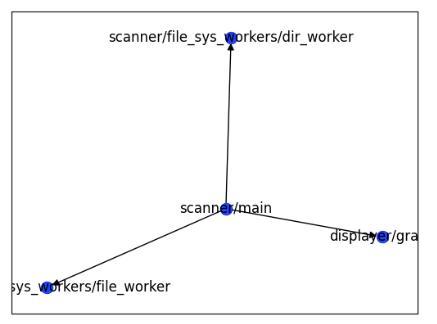

# ProjectScanner 
----

After installing use next commands
```
poetry install
poetry shell
```

After running **app.py** you input project for scan. Example:
``
Input project path: /Users/userX/PycharmProjects/ProjectScanner
``

Then you can see graph with connections of files in your project. It helps to you for refactoring your project architecture!

